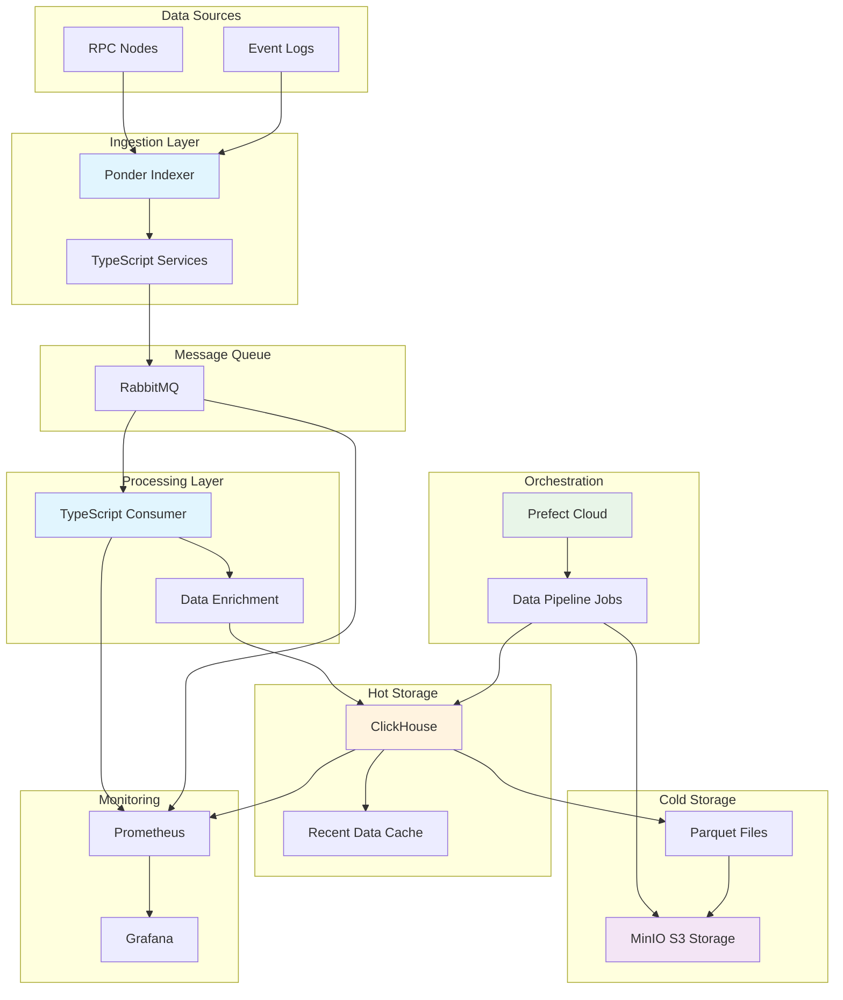
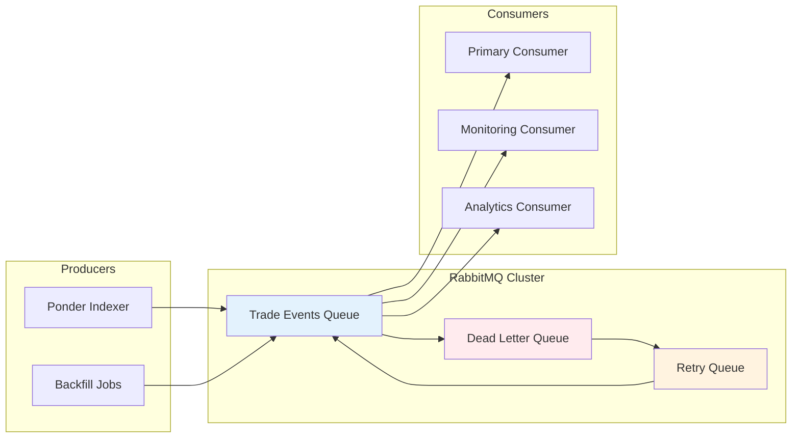
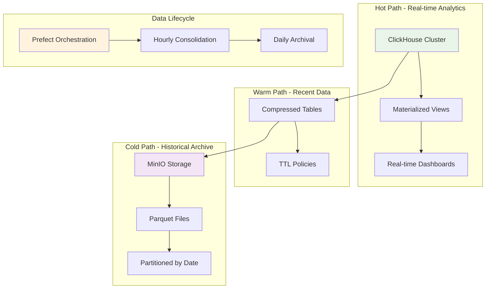
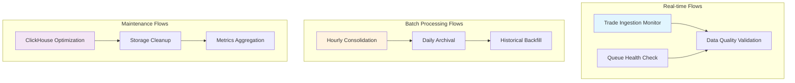

# Onchain Trade Indexer

A comprehensive data engineering platform for indexing, processing, and analyzing all trade events on EVM and Solana. This system provides real-time ingestion, efficient storage, and powerful analytics capabilities for decentralized exchange activity across the entire blockchain ecosystem.

## Overview

The Onchain Trade Indexer is designed to handle the massive scale of on-chain trading data, processing millions of trade events daily from major DEXs including Uniswap, SushiSwap, Curve, Balancer, and 1inch. The platform combines real-time streaming architecture with cost-effective long-term storage, enabling both operational monitoring and historical analysis of DeFi trading patterns.

### Key Features

- **Complete Coverage**: Indexes all trade events from major EVM & Solana DEXs
- **Real-time Processing**: Sub-second ingestion of new trades as they occur
- **Scalable Architecture**: Handles 100M+ trades per day without performance degradation
- **Cost-Optimized Storage**: Tiered storage strategy balancing query performance with storage costs
- **Rich Analytics**: Pre-computed aggregations and flexible querying capabilities
- **Production Ready**: Comprehensive monitoring, alerting, and operational tooling

## Architecture Overview

The system follows a modern data engineering pattern with clear separation between ingestion, processing, storage, and analytics layers.



## Component Architecture

### Indexing Layer

**Ponder Framework**: Serves as the primary blockchain indexer, providing a TypeScript-native solution for real-time event processing. Ponder handles the complexity of blockchain reorganizations, provides automatic retries for failed RPC calls, and offers a declarative configuration for specifying which contracts and events to monitor.

**Event Processing**: The indexer monitors contract addresses for major DEXs, filtering for swap-related events and extracting essential trade data including token pairs, amounts, prices, and transaction metadata. Built-in ABI decoding ensures reliable parsing of complex event structures.

### Message Queue Architecture



**RabbitMQ Configuration**: Single-instance deployment optimized for high throughput, with persistent queues ensuring no data loss during system restarts. The queue architecture includes automatic dead letter handling for malformed events and configurable retry logic for transient processing failures.

**Message Format**: Trade events are serialized as JSON with a standardized schema including transaction hash, block number, log index, DEX protocol identifier, token addresses, amounts, and timestamps. This format enables efficient processing while maintaining flexibility for schema evolution.

### Processing Pipeline

**TypeScript Consumer**: Implements a scalable consumer pattern with configurable parallelism, processing trade events in micro-batches to optimize database write performance. The consumer handles data validation, enrichment with external metadata, and reliable delivery to the storage layer.

**Data Enrichment Pipeline**:

- Token metadata resolution (symbols, decimals, names)
- USD price calculation using historical price feeds
- Gas cost computation in both ETH and USD
- MEV detection algorithms for sandwich attacks and arbitrage
- Wallet classification (DEX aggregators, known bots, institutional traders)

### Storage Strategy



**ClickHouse Hot Storage**: Optimized for real-time analytics with custom partitioning by timestamp and protocol. Implements compression algorithms achieving 10:1 compression ratios while maintaining sub-second query performance for recent data.

**MinIO Cold Storage**: S3-compatible object storage for long-term data retention. Parquet files are organized with Hive-style partitioning (`year=2024/month=01/day=01/`) enabling efficient querying of historical data using modern analytics engines.

## Data Pipeline Orchestration

### Prefect Workflow Architecture



**Flow Definitions**: Prefect orchestrates the entire data lifecycle through Python-based flows that handle extraction, transformation, and archival processes. Each flow includes comprehensive error handling, automatic retries, and detailed logging for operational visibility.

**Data Movement Patterns**:

- **Hourly Consolidation**: Extracts recent trades from ClickHouse, aggregates into optimized Parquet files
- **Daily Archival**: Moves consolidated data to cold storage, updates metadata catalogs
- **Historical Backfill**: Processes historical blockchain data for complete coverage

### Monitoring and Observability

**Prometheus Metrics Collection**:

- Application metrics: Request rates, error counts, processing latencies
- Infrastructure metrics: CPU, memory, disk usage, network throughput
- Business metrics: Trades processed, data freshness, pipeline lag
- Queue metrics: Message rates, consumer lag, dead letter counts

**Grafana Dashboards**:

- **Operational Dashboard**: System health, pipeline status, error rates
- **Business Dashboard**: Trade volumes, protocol market share, price movements
- **Performance Dashboard**: Query latencies, resource utilization, bottleneck analysis

## Infrastructure Requirements

### Compute Resources

| Component           | CPU          | Memory       | Storage    | Estimated Cost  |
| ------------------- | ------------ | ------------ | ---------- | --------------- |
| Ponder Indexer      | 2 cores      | 4GB RAM      | 50GB SSD   | $40/month       |
| RabbitMQ            | 2 cores      | 4GB RAM      | 100GB SSD  | $50/month       |
| TypeScript Consumer | 4 cores      | 8GB RAM      | 20GB SSD   | $80/month       |
| ClickHouse          | 8 cores      | 32GB RAM     | 1TB SSD    | $200/month      |
| MinIO Storage       | 2 cores      | 4GB RAM      | 10TB HDD   | $150/month      |
| Monitoring Stack    | 2 cores      | 4GB RAM      | 100GB SSD  | $50/month       |
| **Total**           | **20 cores** | **56GB RAM** | **11.3TB** | **~$570/month** |

### Network and Security

**Infrastructure Security**:

- All communications encrypted with TLS 1.3
- Network isolation using VPC with private subnets
- Secrets management through dedicated vault system
- Regular security updates and vulnerability scanning

**API Rate Limiting**: Ethereum RPC calls are distributed across multiple providers (Alchemy, Infura, QuickNode) with intelligent failover and rate limiting to ensure uninterrupted data flow.

## Data Schema and Analytics

### Core Data Models

**Trades Fact Table**:

```sql
CREATE TABLE trades (
    transaction_hash String,
    block_number UInt64,
    log_index UInt32,
    timestamp DateTime64(3),
    protocol LowCardinality(String),
    token_in_address String,
    token_out_address String,
    amount_in UInt256,
    amount_out UInt256,
    amount_usd Decimal(18,8),
    trader_address String,
    gas_used UInt64,
    gas_price_gwei Decimal(10,2),
    is_mev_detected UInt8
) ENGINE = MergeTree()
PARTITION BY toYYYYMM(timestamp)
ORDER BY (timestamp, protocol, token_in_address);
```

**Aggregated Metrics Tables**:

- Hourly trade volumes by protocol and token pair
- Daily unique user counts and transaction summaries
- Protocol market share and competitive analysis
- Price impact analysis and liquidity metrics

### Query Performance Optimization

**Materialized Views**: Pre-computed aggregations for common analytical queries, updated in real-time as new trades are ingested. These views enable sub-second response times for dashboard queries and API endpoints.

**Projection Indexes**: Custom sorting keys optimized for different query patterns, allowing the same data to be efficiently accessed by timestamp, protocol, or token address depending on the analytical use case.

## Development and Deployment

### Technology Stack

- **Runtime**: Node.js 20+ with TypeScript 5.0
- **Indexing**: Ponder framework for blockchain event processing
- **Message Queue**: RabbitMQ 3.12 with management plugin
- **Database**: ClickHouse 23.8 with custom configurations
- **Storage**: MinIO compatible with S3 API
- **Orchestration**: Prefect Cloud with Python 3.11
- **Monitoring**: Prometheus 2.45 + Grafana 10.0
- **Infrastructure**: Docker containers with Railway deployment

### Deployment Strategy

**Environment Management**:

- Development: Local Docker Compose stack for rapid iteration
- Staging: Railway deployment with reduced scale for testing
- Production: Multi-region deployment with automatic failover

**CI/CD Pipeline**:

- Automated testing including unit tests and integration tests
- Database migration validation and rollback procedures
- Blue-green deployment strategy for zero-downtime updates
- Comprehensive monitoring during deployment phases

## Performance Characteristics

### Throughput Metrics

- **Ingestion Rate**: 2,000+ trades per second during peak periods
- **Query Performance**: <100ms for real-time dashboard queries
- **Storage Efficiency**: 85% compression ratio for historical data
- **System Availability**: 99.9% uptime with automatic failover

### Scalability Patterns

**Horizontal Scaling**: Consumer processes can be scaled independently based on queue depth, ClickHouse supports clustering for increased write throughput, and MinIO provides distributed storage capabilities.

**Cost Optimization**: Intelligent data tiering moves older data to progressively cheaper storage tiers while maintaining query performance for recent data through caching and indexing strategies.

## Getting Started

### Prerequisites

- Node.js 20+ and npm/yarn
- Docker and Docker Compose
- Python 3.11+ for Prefect workflows
- RPC access (EVM)
- gRPC access (Solana)

### Configuration

The system uses environment-based configuration with sensible defaults for development. Production deployments require additional configuration for clustering, security, and monitoring integrations.

## Contributing

This project welcomes contributions from the DeFi and data engineering communities. Whether you're interested in adding support for new DEX protocols, optimizing query performance, or enhancing the monitoring capabilities, there are opportunities to make meaningful improvements to the platform.

### Areas for Enhancement

- Support for additional blockchain networks (Polygon, Arbitrum, Base)
- Advanced MEV detection algorithms and classification
- Machine learning models for trade pattern analysis
- Real-time alerting for unusual market conditions
- API endpoints for external data access

## License

MIT License - see LICENSE file for details.

---

_This system represents a production-ready approach to blockchain data engineering, combining modern streaming architectures with proven data warehouse patterns to deliver reliable, scalable, and cost-effective analytics capabilities for the DeFi ecosystem._
